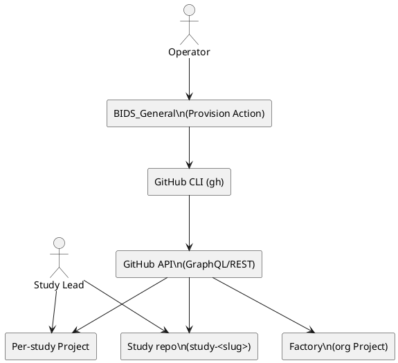
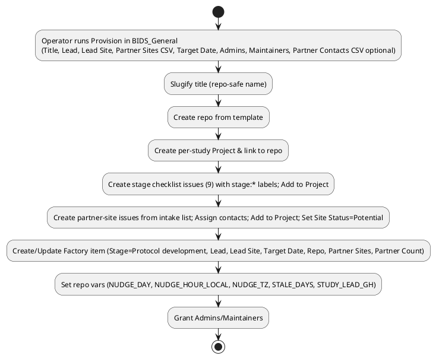

# SPEC-2-Factory — OHDSI Network Study Tracking

## Background

The JHU “Observational Research Lab” coordinates OHDSI network studies with distributed researchers and data partners. Tracking is inconsistent and manual, making it hard to see progress or prioritize help. We will standardize on GitHub Enterprise (org: **JHU‑OHDSI**) using a **Hybrid** model:

* **Factory**: one org‑level Project (portfolio) with a single item per study.
* **Per‑study space**: one repository per study plus a small per‑study Project for day‑to‑day work.

Design goals:

* **Low‑code & high‑automation** (operators click a form; leads “close a checklist” to advance stages).
* **Clinician‑friendly** (minimal PM skills needed).
* **Portable to OHDSI** (language‑neutral template; Strategus optional later).
* **Everyone can edit Factory fields**; automation owns key roll‑ups (Stage, Partner Sites/Count).

## Requirements

### Must‑have

* **One repo per study** created from a template; per‑study Project linked to that repo.
* **Factory** portfolio with one row per study showing: **Stage**, **Lead**, **Lead Site**, **Partner Sites** (auto‑managed), **Partner Count** (auto), **Target Date**, **Study Repo**.
* **Provision New Study** Action in **`Factory`** repository that:

  * creates repo & project; seeds **9 stage checklist issues** (from Ben’s framework);
  * creates **partner‑site issues** from intake (Status = **Potential**);
  * links study to Factory; sets permissions and defaults; no manual issue creation by operator.
* **Stage advancement** by closing the corresponding **stage checklist issue**; automation updates the per‑study Project and Factory.
* **Weekly partner nudges** (default **Mon 9:00 ET**) with lead‑configurable schedule per repo.
* **External collaborators** may be added as repo collaborators/assignees.

### Should‑have

* **Issue Forms**: “Add Data Partner” (single) and “Bulk Add Data Partners” (multi‑line) to add partners post‑provision.
* **Factory Health** digest posted to `BIDS_General` weekly (Mon 9:05 ET): counts by Stage, overdue studies, Partner Count per study.
* Simple, language‑neutral **README** in each study repo following OHDSI conventions; note that Strategus scaffolding can be added later.

### Could‑have

* **Protocol URL** field in per‑study Project and Factory (populated from README) for quick filtering.
* Optional analytics of stage cycle times (derived from timestamps on checklist issues).

### Won’t‑have (now)

* Separate IRB/DUA tracker; instead, **Lead‑site IRB approval** is a mandatory acceptance criterion in **Protocol development**. Partner‑site regulatory details live on each **partner‑site issue**.

## Method

### Stages (Ben‑owned)

1. Protocol development
2. Data diagnostics
3. Phenotype development
4. Phenotype evaluation
5. Analysis specifications
6. Network execution
7. Study diagnostics
8. Evidence synthesis
9. Results evaluation

> **Acceptance criteria highlight**: Protocol development includes **Lead‑site IRB approved** before Network execution can proceed.

### Canonical fields

**Factory (org Project)**

* **Stage** (single‑select; automation‑owned)
* **Lead** (text)
* **Lead Site** (text)
* **Partner Sites** (text; auto‑managed list derived from partner‑site issues)
* **Partner Count** (number; auto)
* **Target Date** (date)
* **Study Repo** (text/URL)

**Per‑study Project**

* **Stage** (single‑select; automation‑owned)
* *(Optional)* **Protocol URL** (text)
* **Site Status** (single‑select for partner‑site issues only): `Potential, Invited, Diagnostics Sent, Diagnostics Returned, Package Executed, Results Uploaded, Blocked`

### Labels (minimal)

* `stage:protocol-development` … `stage:results-evaluation` (used only on **stage checklist issues**)
* `partner-site` (used on **one issue per site**)

### Study template repository (language‑neutral)

* `.github/ISSUE_TEMPLATE/` — 9 **stage checklist** templates (each with 4–8 acceptance checks; Protocol includes “Lead‑site IRB approved”).
* `.github/ISSUE_TEMPLATE/add_partner.yml` — Issue Form (Site, @GitHub, Email optional, Notes) → creates **partner‑site** issue and adds to Project with **Site Status=Potential**.
* `.github/ISSUE_TEMPLATE/bulk_add_partners.yml` — Issue Form (one site per line; optional `@github,email,notes`) → creates multiple partner‑site issues.
* `.github/workflows/` — automation workflows (see below).
* `README.md` — OHDSI‑style sections (Purpose, Leads, Protocol link, Cohorts/ATLAS links, How to run, Results sharing) + **“Working with Data Partners”** quick guide.
* `docs/STRATEGUS.md` — placeholder explaining optional future Strategus scaffold.

### Automation logic (summary)

* **Provisioning:** From `BIDS_General` input → create repo & Project; create stage checklist issues (labeled `stage:*`); parse Partner Sites CSV → create partner‑site issues (label `partner-site`), assign contact if provided; add all issues to Project; create/update Factory item; set repo variables & permissions.
* **Advance Stage:** On **issue closed** matching a stage label → set per‑study **Stage** and mirror to **Factory**.
* **Partner updates to Factory:** On partner‑site issue created/closed/retitled → recompute **Partner Sites** (CSV of open partner‑site titles) and **Partner Count** → update Factory item.
* **Weekly Partner Nudge:** Scheduled (default Mon 9:00 ET; configurable via repo vars) → comment on **stale** partner‑site issues (no activity for `STALE_DAYS`, default 7) tagging assignees; update one **Weekly Partner Nudge** digest issue tagging the Study Lead.
* **Factory Health digest:** Scheduled in `BIDS_General` (Mon 9:05 ET) → summarize Factory by Stage, overdue Target Dates, Partner Counts.

### PlantUML — Component view

### PlantUML — Provisioning flow

## Implementation

### Org/Secrets/Vars

* **Org:** `seanr87` (GitHub.com for demo)
* **Home repo:** `Factory` (contains provision workflow)
* **Secrets (org or repo):** `ORG_ADMIN_TOKEN` (fine‑grained PAT; repo create, project write, contents write), `ORG_LOGIN=seanr87`, `TEMPLATE_REPO=seanr87/study-template`
* **Variables (repo):** `FACTORY_PROJECT_NUMBER` (not sensitive, should be a variable)
* **Repo variables per study:** `STUDY_LEAD_GH`, `NUDGE_DAY=Mon`, `NUDGE_HOUR_LOCAL=9`, `NUDGE_TZ=America/New_York`, `STALE_DAYS=7`

### A) Provision New Study (in `Factory` repository)

Inputs: `study_title, lead, lead_site, partner_sites (CSV), partner_contacts_csv (optional), target_date, admins, maintainers`
Key steps (gh CLI + GraphQL):

1. **Auth** with `ORG_ADMIN_TOKEN`.
2. **Slugify** title → `study-<kebab>`.
3. **Create repo** from template; **create org Project** “Study: <Title>”; **link** repo↔project.
4. **Create per‑study Project fields**: Stage (single‑select), Site Status (single‑select), *(optional) Protocol URL*.
5. **Seed issues**: create 9 **stage checklist issues** with `stage:*` labels; add to project.
6. **Partner intake**: parse `partner_sites` CSV; for each site create a **partner‑site issue** (Status=Potential); if `partner_contacts_csv` provided, match & assign.
7. **Factory item**: create/update one item in Factory; set Lead/Lead Site/Target/Repo; populate **Partner Sites/Count**.
8. **Permissions**: add Admins (admin) & Maintainers (maintain).
9. **Repo variables**: set `STUDY_LEAD_GH`, `NUDGE_*`, `STALE_DAYS`.

### B) Stage sync (per‑study template)

Trigger: `issues: [closed, reopened, labeled]`

* If a closed issue has a `stage:*` label, map to Stage name and update:

  * **Per‑study Project → Stage** (single‑select)
  * **Factory → Stage** for that study’s item

### C) Partner sync (per‑study template)

Trigger: `issues: [opened, closed, edited, labeled, unlabeled]` filtered to `partner-site`

* Recompute **Partner Sites** (CSV of open partner‑site titles) and **Partner Count**; update Factory item.
* On `assigned`/`reassigned`, add a welcome comment mentioning assignee & Study Lead.

### D) Weekly Partner Nudge (per‑study template)

Trigger: `schedule` (hourly) + `workflow_dispatch`

* Read repo variables `NUDGE_DAY`, `NUDGE_HOUR_LOCAL`, `NUDGE_TZ`, `STALE_DAYS`.
* If current local time matches, build stale list (no activity > `STALE_DAYS`) for `partner-site` issues with Site Status ∈ {Potential, Invited, Diagnostics Sent, Diagnostics Returned}.
* Comment on each stale issue tagging the **assignee**; update/create a **Weekly Partner Nudge** digest issue tagging the **Study Lead**.

### E) Factory Health digest (in `Factory` repository)

Trigger: `schedule: Mon 09:05 ET` + `workflow_dispatch`

* Query Factory items → counts by Stage; overdue (Target < today); Partner Count per study.
* Post/update a “Factory Health — <date>” issue; @mention the Lab team.

### F) Views & Guidance

* **Factory**: Table grouped by Stage; columns Lead, Lead Site, Partner Sites, Partner Count, Target Date, Repo. Board view by Stage. Insights: Items by Stage; Overdue.
* **Per‑study**: Simple board with Stage groups and a **Partner Tracker** board filtered to `partner-site` issues and showing **Site Status**.
* **README (template)**: 5‑minute Lead guide (Where to work; How to progress—close checklists; How to add partners; Change nudge time; Where to put protocol/cohort links). Strategus note.

## Milestones

1. **Week 0:** Confirm stage wordings (Ben), finalize fields/labels; create Factory.
2. **Week 1:** Build study template repo (issues, forms, workflows); create Provision Action in `BIDS_General`; set secrets.
3. **Week 2:** Pilot on 2 studies; validate stage sync, partner flows, nudges; tune wording.
4. **Week 3:** Add Factory Health digest; finalize views & Insights; write 1‑page Lead guide in README.
5. **Week 4:** Roll out to remaining studies; publish template + provisioner as reusable assets for OHDSI.

## Gathering Results

* **Visibility:** 100% of active studies appear in Factory with non‑empty **Stage**.
* **Adoption:** ≥90% of new studies provisioned via the Action (not ad‑hoc repos).
* **Latency:** Average days from **Protocol development → Network execution**; % hitting **Target Date**.
* **Partner engagement:** Median days a site stays in **Invited/Diagnostics Sent**; Partner Count trend by study.
* **Hygiene:** <5% of studies missing Lead/Lead Site/Target Date; no lingering open **stage checklist** for completed stages.

## Need Professional Help in Developing Your Architecture?

Please contact me at [sammuti.com](https://sammuti.com) :)
