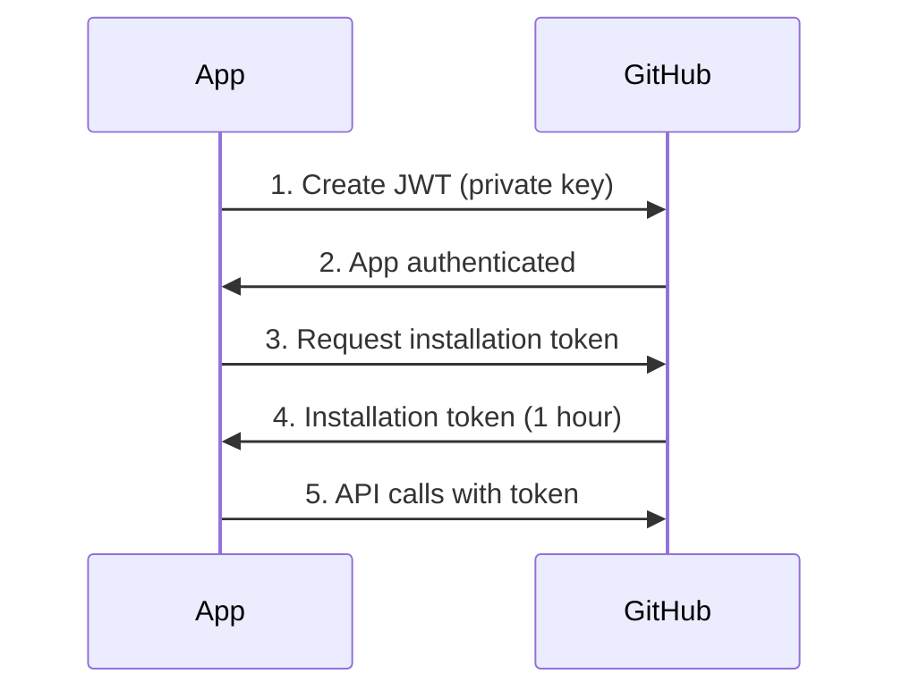

# GitHub App Authentication

## Overview
GitHub Apps provide fine-grained permissions and higher rate limits than PATs. The Factory App handles portfolio synchronization.

## Authentication Flow



## Python Implementation

### JWT Creation
```python
import jwt
import time
from pathlib import Path

def create_jwt(app_id: str, private_key_path: str) -> str:
    """Create JWT for GitHub App authentication."""
    private_key = Path(private_key_path).read_text()
    
    payload = {
        "iat": int(time.time()),
        "exp": int(time.time()) + 600,  # 10 minutes
        "iss": app_id
    }
    
    return jwt.encode(payload, private_key, algorithm="RS256")
```

### Installation Token Exchange
```python
import httpx

async def get_installation_token(jwt: str, installation_id: str) -> str:
    """Exchange JWT for installation access token."""
    headers = {
        "Authorization": f"Bearer {jwt}",
        "Accept": "application/vnd.github.v3+json"
    }
    
    async with httpx.AsyncClient() as client:
        response = await client.post(
            f"https://api.github.com/app/installations/{installation_id}/access_tokens",
            headers=headers
        )
        response.raise_for_status()
        return response.json()["token"]
```

## Webhook Verification

```python
import hmac
import hashlib

def verify_webhook(payload: bytes, signature: str, secret: str) -> bool:
    """Verify GitHub webhook signature."""
    expected = hmac.new(
        secret.encode(),
        payload,
        hashlib.sha256
    ).hexdigest()
    
    return hmac.compare_digest(
        f"sha256={expected}",
        signature
    )
```

## Factory App Permissions

### Required Permissions
- **Issues**: Read/Write (portfolio updates)
- **Projects**: Read/Write (project board sync)
- **Contents**: Read (study repo monitoring)
- **Metadata**: Read (basic repo info)

### Webhook Events
- `issues` - Stage changes
- `issue_comment` - Updates
- `project_card` - Board movements
- `repository` - New study creation

## Rate Limits
- **App**: 5,000 requests/hour
- **Installation**: 5,000 requests/hour per repo
- **User-to-server**: 5,000 requests/hour

## Security Best Practices
1. Store private key in secure secret manager
2. Rotate private keys annually
3. Validate webhook signatures
4. Use installation tokens (not JWT) for API calls
5. Implement token caching (50 minutes max)
6. Log all authentication events

## Environment Variables
```bash
GITHUB_APP_ID=123456
GITHUB_APP_PRIVATE_KEY_PATH=/secrets/private-key.pem
GITHUB_APP_WEBHOOK_SECRET=your-webhook-secret
GITHUB_APP_INSTALLATION_ID=789012
```