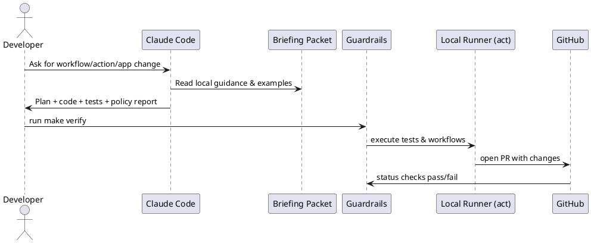

# SPEC-002-LLM Briefing Packet for GitHub Actions & GitHub App Development

## Scope
Defines the offline-first Briefing Packet (docs, golden examples, and guardrails) that any coding agent (Claude Code) MUST read and cite before generating or modifying GitHub Workflows, Actions, or GitHub App code. **SPEC-001 depends on this spec.**

## Background

You want an LLM to generate production‑ready code for GitHub Workflows/Actions and a GitHub App. Because GitHub’s platform evolves (runner images, permissions, reusable workflows, App auth, environments), the safest way to keep the LLM correct is to “ground” it with a structured Briefing Packet and guardrails:

* A concise, version‑pinned overview of **Actions**, **Workflows**, and **GitHub Apps** with org‑specific conventions.
* A **Golden Examples** repo (runnable, linted, tested) demonstrating the patterns we expect the LLM to follow.
* A lightweight **Knowledge & Safety Check** suite the LLM must satisfy (linting, local execution with `act`, security checks like least‑privilege `GITHUB_TOKEN`, environment approvals).
* A **Prompting Contract** (templates that force the LLM to cite sources from the packet and emit checklists before code).

This packet becomes the single source of truth that any coding agent uses—either via direct file upload/context or by linking to an internal docs site—so results are current, secure, and consistent.

## Requirements

### MoSCoW Prioritization

**Must Have**

* **Offline-first Briefing Packet** (checked into repo and zippable for Claude Code ingestion):

  * `briefing/actions/` – Concepts, do/don'ts, permission model, caching, concurrency, artifacts, matrices, environments/approvals.
  * `briefing/workflows/` – Syntax quick-ref, reusable workflows (`workflow_call`), composites vs JS/container actions, examples.
  * `briefing/apps/` – GitHub App model, permissions/events, auth flows (App and Installation tokens), webhooks, rate limits.
  * `briefing/security/` – Least-privilege `GITHUB_TOKEN`, secret handling, OIDC to cloud, SBOMs/artifacts policies.
  * `briefing/prompting/` – Prompt templates + “contract” (plan → code → tests → self-check), citation policy pointing to packet files.
* **Docs Freeze (Offline)**: snapshot of key GitHub Docs pages and API schemas into `vendor/docs/` with metadata (URL, date, commit hash) so the agent can quote the local copy. Update cadence: monthly or on breaking change.
* **Golden Examples Repo** (runnable offline):

  * Reusable workflow library (build/test/release; PR checks; release-please; labels).
  * Minimal-permissions examples, environment approvals, job/step `if:` guards, concurrency groups, caching patterns, artifact upload/download.
  * Three action types: Composite, JavaScript (Node), Container; each with tests and local runners.
* **Knowledge & Safety Checks** (offline where possible):

  * `actionlint`, YAML lint, shellcheck for bash steps; unit tests for JS actions; `act` for local workflow runs; `gitleaks` for secret scanning.
  * Policy checks: verify `permissions:` blocks, prohibit `GITHUB_TOKEN: write-all`, enforce pinned `uses:` SHAs for third-party actions.
* **Version Pinning & Compatibility Matrix**: runners (`ubuntu-XX`), Node LTS, `actions/*` versions/SHA pins, Octokit client version (if Node), webhook/event versions.
* **Local Dev Bootstrap**: `make bootstrap && make test` works offline using vendored tool binaries or lockfiles.
* **Claude Code Packaging**: a single `briefing.zip` + repo layout optimized for Claude Code’s context window (short files, stable headings, summary indexes).

**Should Have**

* **GitHub App Skeleton** with CI: **Python** implementation (FastAPI or Starlette), webhook verification, manifest-based setup script, App/Installation token flow using PyJWT + httpx, and minimal permission scope. Prefer `githubkit` or `PyGithub` for API calls.
* **Reusable Workflows Catalog** documented in `catalog.md` with inputs/outputs, and semantic versioning for workflow interfaces.
* **Devcontainer** with preinstalled linters, Node LTS, `act`, and testing tools to ensure parity across contributors.
* **Security Hardening**: CodeQL on the examples, dependency review, SBOM generation, and SARIF artifact publishing.
* **LLM Guardrails CLI**: a small wrapper that feeds the packet, enforces the prompting contract, and runs safety checks after code generation.

**Could Have**

* **Ephemeral/Self-hosted Runner Patterns** (optional), ARC patterns, caching strategies for private registries.
* **Docs Site** generated from the packet (e.g., Docusaurus) for human browsing, still source-of-truth remains the repo.
* **Patterns for Monorepo vs Polyrepo** with examples.

**Won’t Have (for now)**

* Live web lookups during code generation (agent should rely on the packet except during scheduled doc refreshes).
* Auto-merge or production deployments without human approval.

### References (to include in the packet)

* GitHub Actions: workflow syntax, reusable workflows, permissions, environments & approvals.
* GitHub Apps: permissions, events, auth (App/Installation tokens), webhooks, Octokit.
* Local testing: `act`, `actionlint`, secret scanning (gitleaks), shellcheck.

## Method

### Monorepo Layout (offline-first)

```
/briefing/                 # The packet Claude ingests
  index.md                 # How to use this packet
  actions/*.md             # Concepts: runners, permissions, caching, concurrency, artifacts, matrices
  workflows/*.md           # Syntax quick-ref, reusable workflows (workflow_call), composites vs container actions
  apps/*.md                # App model, events, permissions, auth (JWT → installation access token), webhooks
  security/*.md            # Least-privilege, OIDC to cloud, secret policy, pull_request vs pull_request_target
  prompting/*.md           # Prompt templates + contract (plan→code→tests→self-check)
  checklists/*.md          # PR checklist, release checklist
/vendor/docs/              # Snapshotted GitHub docs (HTML/MD + metadata.json)
/examples/
  workflows/reusable/      # Library of callable workflows
    python-ci.yaml         # Reusable: lint+test+build; minimal permissions; env approvals
    release-python.yaml    # Reusable: build wheel, generate SBOM, upload artifact
  actions/
    composite/setup-python/  # Composite action for consistent Python setup + caching
    container-python/        # Container action (Docker) running Python tools offline
/app/                      # GitHub App (Python)
  src/app/main.py          # FastAPI app with `/webhook`
  src/app/auth.py          # JWT (PyJWT) + installation token exchange (httpx)
  src/app/routers/*.py     # Example handlers for events (pull_request, check_suite)
  tests/                   # Unit tests for webhook signature, auth
/tools/
  guardrails/              # Policy checks (permissions, pinned uses, secrets)
  linters/                 # actionlint, yamllint, shellcheck wrappers
  scripts/                 # make targets: bootstrap, test, act
/catalog.md                # Reusable workflows & actions index (inputs/outputs, versions)
```

### Prompting Contract (what the LLM must do)

* **Read-first**: cite local packet paths (e.g., `briefing/workflows/reusable.md`).
* Emit plan → code → tests → self‑check.
* Produce a **policy report**: permissions diff, `uses:` pinning (commits), secret use, `pull_request_target` check.
* Only propose patterns from `/examples` unless packet says otherwise.

### Golden Examples: minimum set

* **Reusable Workflow**: `python-ci.yaml` with `workflow_call` inputs; jobs: `lint`, `test`, `build`; `permissions: contents: read, packages: write` only where needed; environment approvals via `environments:`.
* **Composite Action**: `setup-python` using `actions/setup-python` (pinned) + `pip cache` + constraints file.
* **Container Action (Python)**: runs `ruff`, `pytest`, `pip-audit` offline using a prebuilt image and vendored wheels.
* **App Demo**: App adds a status check that enforces minimal `permissions:` or blocks PR.

### GitHub App (Python) – skeleton decisions

* **Framework**: FastAPI (sync or async) with Uvicorn; `hmac` verification of `X-Hub-Signature-256`.
* **Auth**: Create JWT with App private key (PyJWT) → exchange for installation token (httpx) → call REST with `githubkit` or `PyGithub`.
* **Storage**: none (stateless) or tiny SQLite for idempotency if needed.

### Policy & Safety (automated checks)

* **Permissions**: require `permissions:` per job; block `write-all`.
* **Pin third‑party actions** by commit SHA; maintain `third_party_actions.lock`.
* **Prevent unsafe contexts**: flag `pull_request_target` on public repos; isolate secrets via environments/required reviewers.
* **Secrets**: disallow `secrets.GITHUB_TOKEN` re‑export; require OIDC for cloud creds.
* **Tooling**: `actionlint`, `yamllint`, `shellcheck`, `gitleaks`, `pip-audit`.
* **Local run**: `act` profiles for PR and push; smoke tests for each reusable workflow.

### Sequence (PlantUML)



## Implementation

### 0) Defaults

* **Language/stack:** Python (FastAPI, httpx, PyJWT, githubkit). Pure-Python deps → portable. Provide a container image and a venv path.
* **Portability:** Works on GitHub.com and **GHES** (config-driven URLs). No DB; optional SQLite for idempotency.

### 1) Repo bootstrap

* Create folders from **Method**. Add `pyproject.toml` (uv/poetry/pip-tools acceptable), lock deps. Provide `Dockerfile.app` for the App and `Dockerfile.ci` for container action.
* Add `Makefile` targets: `bootstrap`, `lint`, `test`, `verify`, `act-pr`, `act-push`, `brief`.
* Add `.devcontainer/` with preinstalled `actionlint`, `yamllint`, `shellcheck`, `gitleaks`, `act`.

### 2) Vendor critical docs (offline)

* `vendor/sources.yaml` – list of canonical GitHub Docs URLs (Actions syntax, reusable workflows, permissions, environments, Apps auth, OIDC, GHES notes).
* `tools/snapshot_docs.py` – fetch pages → store under `vendor/docs/<slug>.md` with `metadata.json` (url, retrieved\_at, hash).
* `briefing/index.md` links to local copies; packet instructs Claude to **cite local paths**.

### 3) Golden Examples (minimum)

* **Reusable workflow** `examples/workflows/reusable/python-ci.yaml` (triggered via `workflow_call`):

  * Jobs: `lint` (ruff), `test` (pytest), `build` (wheel), each with **minimal `permissions:`** and `concurrency`.
  * `environments:` with required reviewers for `build`.
* **Composite action** `examples/actions/composite/setup-python/action.yaml`:

  * Uses `actions/setup-python@<pinned-sha>` + pip cache + constraints file.
* **Container action** `examples/actions/container-python/`:

  * Docker image with vendored wheels for offline `ruff`, `pytest`, `pip-audit`.
* **App demo** `/app`:

  * `main.py` (FastAPI: `/healthz`, `/webhook`), `auth.py` (JWT→installation token), webhook HMAC verify, example check-run API call.

### 4) Guardrails (automated)

* `tools/guardrails/verify.py`:

  * Run `actionlint`, `yamllint`, `shellcheck`, `gitleaks`, `pip-audit`.
  * Enforce **permissions-per-job**, forbid `write-all`.
  * Require **SHA-pinning** for third-party `uses:`; maintain `third_party_actions.lock`.
  * Flag `pull_request_target` unless explicitly allowed with `allowlist.yml`.
  * Check secrets routing: no secret exposure to untrusted PRs; enforce environments for deployments.
* `tools/guardrails/policy.yml` – tunable rules.

### 5) GHES compatibility

* Config via env or `.env`:

  * `GH_HOST`, `GH_API_URL`, `GH_GRAPHQL_URL` for REST/GraphQL base URLs.
  * `GHES=true|false` and optional `GHES_VERSION` note in docs.
* Packet page `briefing/ghes.md` covers:

  * Hosting **reusable workflows** on the same GHES instance (cannot call from GitHub.com).
  * **Enabling Actions** requires external storage (S3 or Azure Blob) by admins; confirm runners.
  * OIDC for cloud federation: document claims, endpoints, and any enterprise-specific settings.
* Add a small `tools/ghes-smoke.sh` to validate API base, webhook delivery, and a sample workflow run on GHES.

### 6) Packaging for Claude

* `make brief` → `briefing.zip` containing `/briefing`, `/examples`, `/vendor/docs`, `/catalog.md`, `INDEX.md` (one-page map). Short file names, consistent headings.
* Include a **Prompting Contract** card: “Plan → Code → Tests → Policy Report” and path-citation rule.

### 7) CI for the packet itself

* `python-ci.yaml` runs `verify.py` and unit tests on App & actions; publish artifacts (SBOM, `briefing.zip`).
* Optional: nightly job to re-snapshot docs (manual approval), diff changes, open PR.

### 8) Developer quickstart

```
make bootstrap   # install tools (offline if cached)
make verify      # guardrails
make act-pr      # run reusable workflows locally via act
make brief       # produce Claude-ready zip
```

## Milestones

* **M1**: Repo scaffold + devcontainer + Makefile.
* **M2**: Vendor docs + `INDEX.md` + prompting contract.
* **M3**: Golden Examples (reusable workflow, composite, container) + pins.
* **M4**: Guardrails CLI + policies + CI.
* **M5**: Python App skeleton + webhook tests.
* **M6**: GHES guide + smoke scripts + config switches.
* **M7**: First docs freeze (`v1.0`), publish `briefing.zip`.

## Gathering Results

* **Correctness**: act runs green; examples pass; guardrails report = 0 critical.
* **Security**: all `uses:` pinned; least-privilege permissions; no unsafe `pull_request_target` usage.
* **Portability**: same packet works on GitHub.com and GHES (validated by smoke script).
* **Adoption**: N repos consuming the reusable workflow library; decrease in CI policy violations.

## Milestones

*(to be completed)*

## Gathering Results

*(to be completed)*

## Need Professional Help in Developing Your Architecture?

Please contact me at [sammuti.com](https://sammuti.com) :)
